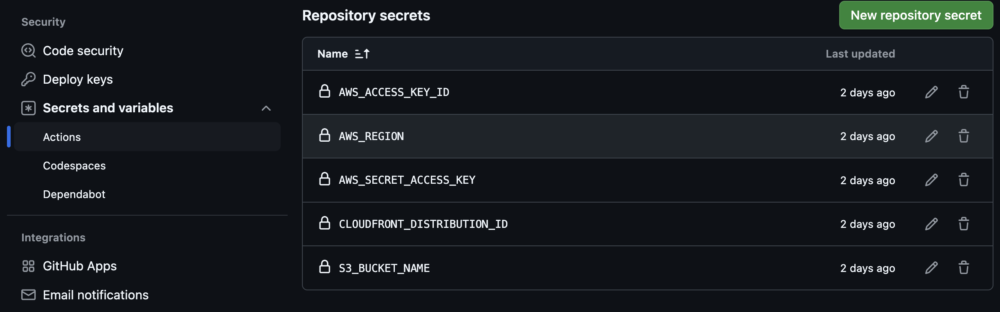
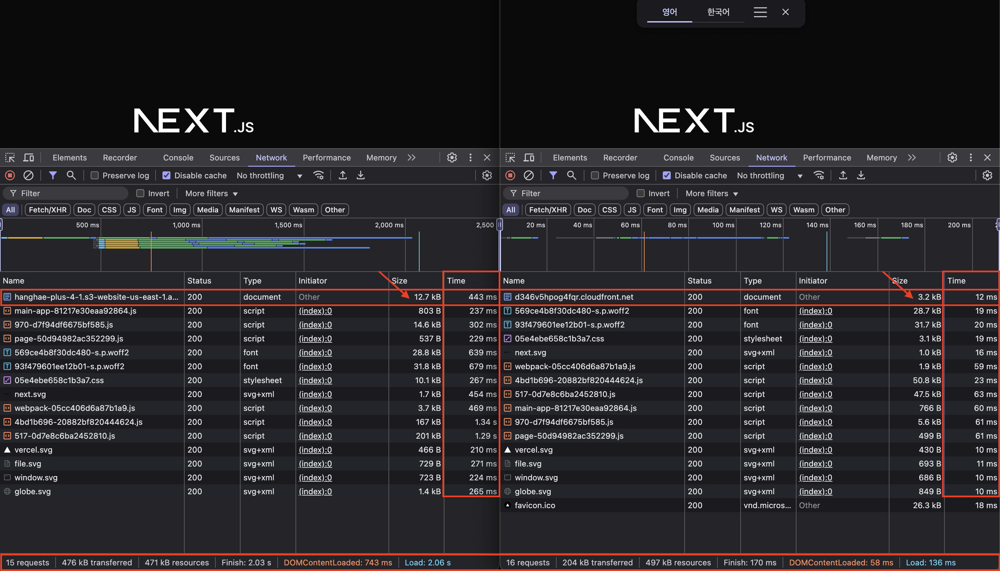
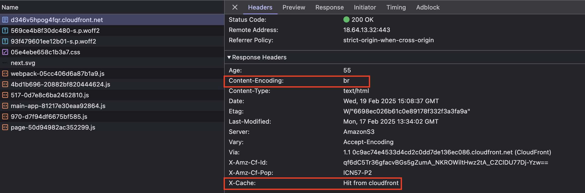

# 프론트엔드 배포 파이프라인

## 개요

.png>)

GitHub Actions에 워크플로우를 작성해 다음과 같이 배포가 진행됩니다.

1. 저장소를 체크아웃합니다.
2. Node.js 18.20.6(LTS) 버전을 설정합니다.
3. 프로젝트 의존성을 설치합니다.
4. Next.js 프로젝트를 빌드합니다.
5. AWS 자격 증명을 구성합니다.
6. 빌드된 파일을 S3 버킷에 동기화합니다.
7. CloudFront 캐시를 무효화합니다.

## 주요 링크

- S3 버킷 웹사이트 엔드포인트: http://hanghae-plus-4-1.s3-website-us-east-1.amazonaws.com
- CloudFrount 배포 도메인 이름: https://d346v5hpog4fqr.cloudfront.net

## 주요 개념

- ### GitHub Actions과 CI/CD 도구

CI/CD 도구는 지속적인 통합(CI)과 지속적인 배포(CD)를 자동화하여 개발 효율성을 높이는 도구입니다.

그중에서도 GitHub에서 제공하는 GitHub Actions는 간단한 설정만으로 GitHub과 원활하게 연동할 수 있어, 이를 활용해 해당 프로젝트의 CI/CD 환경을 구축했습니다.

아래는 GitHub Actions의 프로젝트 설정입니다.

```yml
#.github/workflows/deployment.yml

name: Deploy Next.js to S3 and invalidate CloudFront

on:
  push:
    branches:
      - main
  workflow_dispatch:

jobs:
  deploy:
    runs-on: ubuntu-latest

    steps:
      - name: Checkout repository
        uses: actions/checkout@v4

      - name: Set up Node.js 18.20.6
        uses: actions/setup-node@v3
        with:
          node-version: 18.20.6

      - name: Install dependencies
        run: npm ci

      - name: Build
        run: npm run build

      - name: Configure AWS credentials
        uses: aws-actions/configure-aws-credentials@v2
        with:
          aws-access-key-id: ${{ secrets.AWS_ACCESS_KEY_ID }}
          aws-secret-access-key: ${{ secrets.AWS_SECRET_ACCESS_KEY }}
          aws-region: ${{ secrets.AWS_REGION }}

      - name: Deploy to S3
        run: |
          aws s3 sync out/ s3://${{ secrets.S3_BUCKET_NAME }} --delete

      - name: Invalidate CloudFront cache
        run: |
          aws cloudfront create-invalidation --distribution-id ${{ secrets.CLOUDFRONT_DISTRIBUTION_ID }} --paths "/*"
```

- main 브랜치에 푸시가 이루어질 경우 실행되는 설정

```yml
on:
  push:
    branches:
      - main
```

- jobs(실행할 작업 목록)에 deploy(작업명)이름 아래에서 runs-on(실행환경)을 설정

```yml
jobs:
  deploy:
    runs-on: ubuntu-latest
```

- steps는 jobs 내부에 실행할 작업들 목록을 나타냅니다

```yml
steps:
```

- 실행할 작업 목록

```yml
steps:
  # 저장소 코드를 가져오기
  - name: Checkout repository
    uses: actions/checkout@v4

  # node 설정
  - name: Set up Node.js 18.20.6
    uses: actions/setup-node@v3
    with:
      node-version: 18.20.6

  # CI/CD 환경에서 패키지 설치
  - name: Install dependencies
    run: npm ci

  # 프로젝트 build 시작
  - name: Build
    run: npm run build

  # AWS 인증 설정
  # secrets 정보는
  # setting > screts and variables > actions > Repository secrets 에 등록
  - name: Configure AWS credentials
    uses: aws-actions/configure-aws-credentials@v2
    with:
      aws-access-key-id: ${{ secrets.AWS_ACCESS_KEY_ID }}
      aws-secret-access-key: ${{ secrets.AWS_SECRET_ACCESS_KEY }}
      aws-region: ${{ secrets.AWS_REGION }}

  # AWS S3 저장소 out 폴더 최신 업데이트
  - name: Deploy to S3
    run: |
      aws s3 sync out/ s3://${{ secrets.S3_BUCKET_NAME }} --delete

  # AWS CloudFront 캐시 무효화
  # 이유: CloudFront에 캐싱된 기존 S3 데이터를 삭제하고 최신화 시키기 위해서입니다.
  - name: Invalidate CloudFront cache
    run: |
      aws cloudfront create-invalidation --distribution-id ${{ secrets.CLOUDFRONT_DISTRIBUTION_ID }} --paths "/*"
```

- ### S3와 스토리지

AWS S3(Simple Storage Service)는 AWS에서 제공하는 객체 스토리지 서비스입니다.<br/>
S3는 클라우드 기반의 스토리지 서비스로써 인터넷을 통해 파일을 저장하고 접근할 수 있게 해준다는 특징이 있습니다.

위의 기본적인 특정말고도 더 강력하고 유연한 기능을 제공합니다.

- 웹하드가 주로 개인이나 소규모 그룹의 파일 공유와 백업에 사용된다면, S3는 대규모 애플리케이션과 웹사이트의 데이터 저장소로 활용할 수 있습니다.
- S3는 무한에 가까운 스토리지를 제공하며, 대용량 데이터를 어렵지 않게 다룰수 있습니다.
- S3는 API를 통해 프로그래밍 방식으로 쉽게 접근하고 관리할 수 있어, 개발자들이 애플리케이션에 직접 통합하기가 쉽습니다.
- S3는 버전 관리, 복잡한 접근 제어, 데이터 암호화 등 기업 수준의 고급 기능을 제공합니다.
- S3는 사용한 만큼만 지불하는 방식으로, 대규모 데이터 저장에 더 효율적입니다.

그리고 이러한 기능을 이용하여 해당 프로젝트의 build 된 정적파일을 저장하여 접근할 수 있도록 활용하였습니다.

> **S3 웹사이트 엔드포인트** <br/> > http://hanghae-plus-4-1.s3-website-us-east-1.amazonaws.com

- ### CloudFront와 CDN

CloudFront는 AWS에서 제공하는 콘텐츠 전송 네트워크(CDN) 서비스입니다.<br/>
전 세계에 분산된 엣지 로케이션을 통해 웹 콘텐츠를 사용자에게 빠르게 전달해주는 역할해줍니다.

CDN(Content Delivery Network)는 전 세계에 분산된 서버 네트워크를 이용하여 사용자에게 더 빠르고 안정적으로 웹 콘텐츠를 제공하는 시스템입니다.
그렇기 때문에 CDN을 이용하면 웹사이트의 로딩 속도가 빨라지고, 서버의 부하가 줄어드는 효과를 볼 수 있습니다. 이러한 긍정적인 효과는 전반적인 사용자 경험 향상시킬수 있습니다.

그래서 해당 프로젝트는 CloudFront를 이용해 S3와 연결시켜서 아래와 같은 흐름을 만들어 냈습니다.
<br/>

**[ 최초 연결 시 ]**

- 사용자가 CloudFront URL을 통해 콘텐츠를 요청
- 요청은 사용자와 가장 가까운 엣지 로케이션으로 라우팅
- 엣지 로케이션은 해당 콘텐츠가 캐시되어 있는지 확인
- 캐시에 없다면, 엣지 로케이션이 S3 저장소(원본)에서 콘텐츠를 가져옵니다.
- 가져온 콘텐츠를 사용자에게 제공하고, 동시에 엣지 로케이션에 캐싱

**[ 이후 연결 시 ]**

- 같은 지역의 다른 사용자가 같은 콘텐츠를 요청하면, 이미 엣지 로케이션에 캐시된 콘텐츠를 바로 제공
- 이로 인해 S3로부터 다시 가져올 필요 없이 빠른 속도로 콘텐츠를 제공할 수 있습니다.

이런 흐름을 통해 S3 데이터를 CloudFront에 캐싱하여 사용자에게 빠르게 웹페이지를 보여줄 수 있습니다.

- ### 캐시 무효화(Cache Invalidation)

CloudFront는 캐싱을 이용하는 만큼 사용자에게 빠른 속도로 데이터를 전달할 수 있는 이점이 있지만 주의해야하는 점이 하나 있습니다.

페이지가 업데이트를 통해 최신화가 되어야할 때 캐시를 무효화 시켜주지 않으면 CloudFront는 캐시 수명(TTL) 시간동안 캐싱된 데이터만 보여주게 되기때문에 페이지 업데이트시 항상 캐시 무효화를 진행해주어야합니다.

해당 프로젝트에도 프로젝트 배포시 CloudFront의 캐시가 무효화가 될 수 있도록 코드를 넣어놓았습니다.

```yml
#.github/workflows/deployment.yml

# AWS CloudFront 캐시 무효화
# 이유: CloudFront에 캐싱된 기존 S3 데이터를 삭제하고 최신화 시키기 위해서입니다.
- name: Invalidate CloudFront cache
  run: |
    aws cloudfront create-invalidation --distribution-id ${{ secrets.CLOUDFRONT_DISTRIBUTION_ID }} --paths "/*"
```

위와 같이 GitHub Action 의 deployment.yml 파일을 통해 배포진행시 CloudFront 캐시를 무효화 명령어를 실행시킵니다.

이로써 무사히 S3의 최신 데이터를 다시 캐싱할 수 있습니다.

- ### Repository secret과 환경변수

GitHub Actions에서 보안이 필요한 값(API 키, AWS 자격증명 등등)을 안전하게 관리하기 위해 사용하는 방법이 GitHub의 Repository secret 입니다.



이렇게 저장한 보안 값들은 GitHub Action 파일인 <br/>deployment.yml 에서
`${{ secrets.S3_BUCKET_NAME }}` 와 같은 방법으로 호출하여 사용할 수 있습니다.

## CDN과 성능최적화



왼쪽은 S3의 엔드포인트 접속하면 보이는 네트워크 상태이며,
오른쪽은 CDN으로 연결된 도메인의 네트워크 상태입니다.

보시다시피 CDN의 연결 유무 차이는 content 사이즈와 응답속도에서 엄청난 차이가 나는것을 확인할 수 있습니다.

### Content 사이즈

왼쪽과 오른쪽의 html 파일 사이즈를 본다면
12.7KB 에서 3.2KB 약 **74.02%** 가 압축되어 전송된다는 것을 확인 할 수 있습니다.

### 응답속도

응답속도 또한 html 파일 사이즈 기준으로 443ms 에서 12ms
약 **약 97.29%** 감소가 되었습니다.
그리고 다른 파일들도 CDN이 연결되면 응답속도가 100ms 넘지않습니다.

### 캐싱확인


이렇게 cloudfront를 통해 접속한 페이지는 Content-Encoding 정보와 X-Cache 정보를 확인할 수 있습니다.

### 성능최적화

이처럼 CDN을 연결시킨 것만으로도 파일 **74.02%** 압축, 응답속도는 **약 97.29%** 를 감소시키며 페이지의 엄청난 성능최적화를 보여줄 수 있었습니다.
